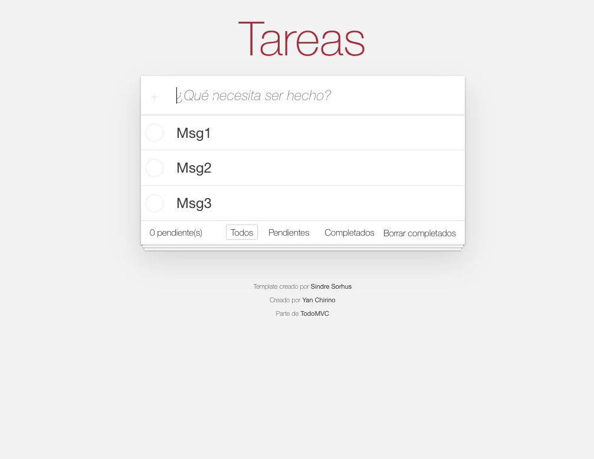

# Lista de Tareas - Aplicación en JavaScript y Vite

Esta es una sencilla aplicación de lista de tareas desarrollada en JavaScript utilizando Vite como herramienta de construcción.

## Características

- Agregar nuevas tareas.
- Marcar tareas como completadas.
- Eliminar tareas.
- Filtrar tareas por estado (completadas o pendientes).
- Interfaz de usuario sencilla y fácil de usar.

## Capturas de Pantalla

## Demo

Puedes ver la aplicación en linea [aqui](https://yanpierchirino.github.io/todo-list/).

## Cómo Usar

1. Clona este repositorio.
2. Abre una terminal y navega al directorio del proyecto.
3. Ejecuta `npm install` para instalar las dependencias.
4. Ejecuta `npm run dev` para iniciar la aplicación en modo de desarrollo.
5. Abre tu navegador y accede a `http://localhost:5173/todo-list/`.

## Contribuciones

Las contribuciones son bienvenidas. Si deseas mejorar esta aplicación, por favor, abre un problema o envía una solicitud de extracción.

## Licencia

Este proyecto está bajo la Licencia GPL-3.0. Consulta el archivo [LICENSE](LICENSE) para obtener más detalles.
